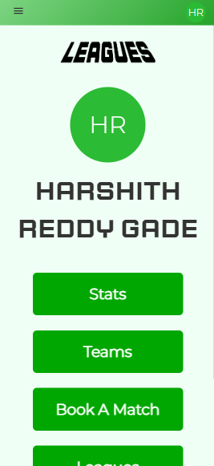
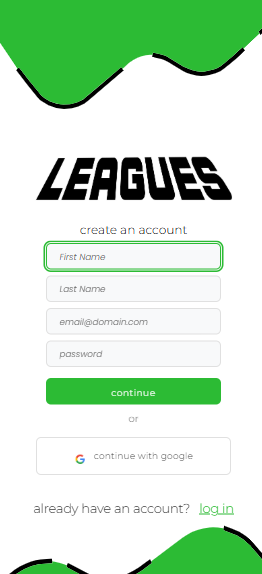
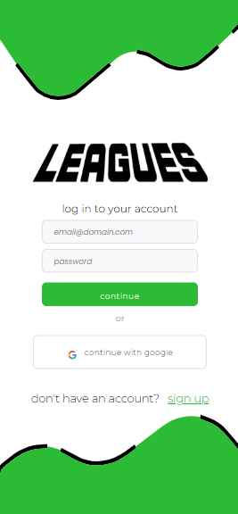
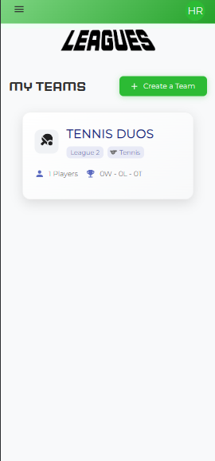
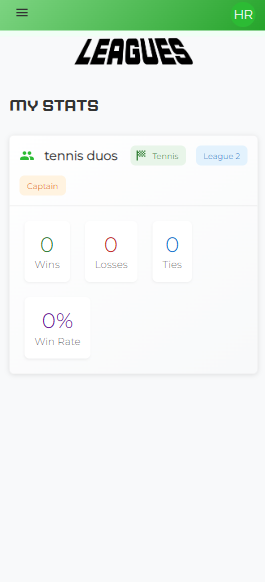
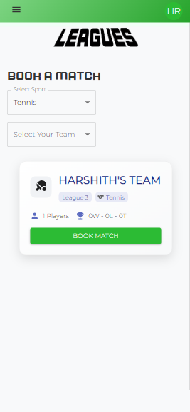
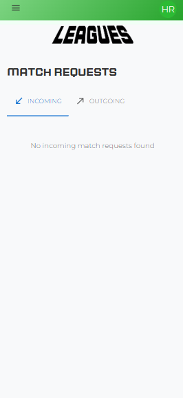
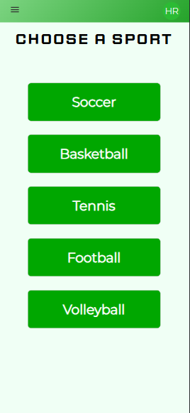
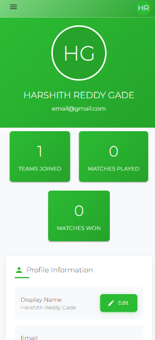

# 🏀 Leagues – A Social Sports Matchmaking Platform



## ▶️ How to Run

Make sure you have Node.js and npm installed.

```bash
npm install
npm run dev
```

## 🎯 Inspiration

We’ve noticed that people our age are getting less physical activity. Technological entertainment is replacing the time usually spent on physical activity. This lack of movement can lead to serious health problems in the future. To fix this, we created **Leagues**.

## 💡 What It Does

**Leagues** is a digital platform that encourages physical activity by enabling friendly matchmaking for sports teams. It prioritizes **fun over competition**, transforming sports into a tool for **social bonding and wellness**. Our skill-based matchmaking system ensures fair games, regardless of experience.

## 🛠️ How We Built It

- **Frontend**: React + Vite + Material UI (MUI)
- **Backend**: Firebase (Firestore + Authentication)
- **Auth**: Google Login via OAuth 2.0
- **Communication**: Git (code collaboration), WhatsApp (team coordination)
- **Version Control**: GitHub

## 🚧 Challenges We Ran Into

- Communication issues due to time zones and poor internet (some teammates were on vacation).
- Debugging Firebase integration and UI responsiveness.
- Managing teamwork with varied experience levels and schedules.

## 🏆 Accomplishments We're Proud Of

- Smooth Firebase integration with real-time updates.
- Building a fully functional web app that could have real community impact.
- Learning and applying modern tools like Vite and MUI efficiently.

## 📚 What We Learned

- How to scale projects according to our skillsets.
- More in-depth experience with **React**, **Firebase**, and **OAuth**.
- Broader understanding of how sports matchmaking platforms could work at scale.

## 🚀 What's Next for Leagues

- Leverage **AI** to provide personalized sports drills based on user match data.
- Partner with local recreational centers to offer **safer** and more **accessible** play areas.
- Expand to **multilingual support** to reach more global communities.

## 🧱 Built With

- [React](https://reactjs.org/) – MIT License
- [Vite](https://vitejs.dev/) – MIT License
- [Firebase](https://firebase.google.com/) – Apache 2.0 License
- [Material UI](https://mui.com/) – MIT License
- [OAuth 2.0](https://oauth.net/2/) – Open Standard
- HTML5, CSS3, JavaScript

## 📝 Attributions & Credits

- **Fonts**:
  - [Montserrat (Italic Variable Font)](https://fonts.google.com/specimen/Montserrat) – Google Fonts, licensed under [Open Font License (OFL)](https://scripts.sil.org/OFL)
  - [Sporty Pro Regular](https://fonts.adobe.com/fonts/sporty-pro) – Licensed via Adobe Fonts (includes commercial/embedded use under Adobe's terms)
  
- **Frameworks & Libraries**:
  - [React](https://reactjs.org/) – MIT License
  - [Vite](https://vitejs.dev/) – MIT License
  - [Material UI](https://mui.com/) – MIT License
  - [Firebase](https://firebase.google.com/) – Apache 2.0 License
  - [OAuth 2.0](https://oauth.net/2/) – Public Standard
  
- **Icons**:
  - All icons used are part of Material UI Icons, licensed under MIT.

- **Design & Styling Tools**:
  - Adobe Fonts – Used under Adobe Creative Cloud license for typography

## 📸 Screenshots

**Sign Up Page**  


**Login Page**  


**Homepage**  


**Teams Page**  


**Stats Page**  


**Book a Match Page**  


**Current Match Requests Page**  


**Upcoming Matches Page**  


**Tutorials Page**  


**Settings Page**  


## 🪪 License

© 2025 Leagues Team (Soumil Voona, Harshith Reddy Gade, Aarnav Munji, Iniyann Vivekanandan). All rights reserved.

This project is proprietary and may not be copied, modified, or distributed without written permission from the team members.
